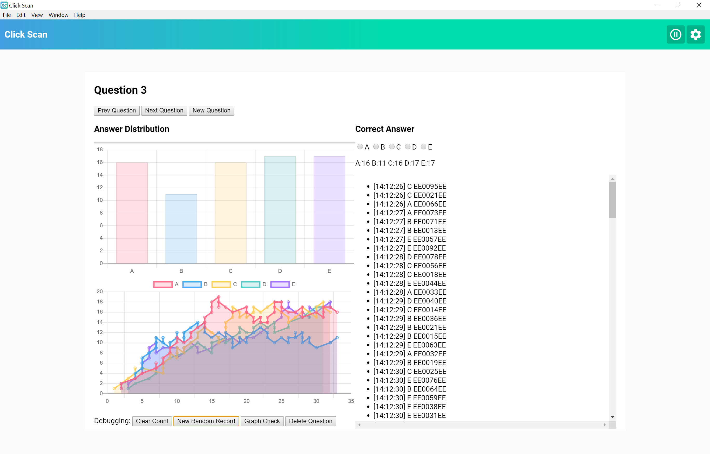
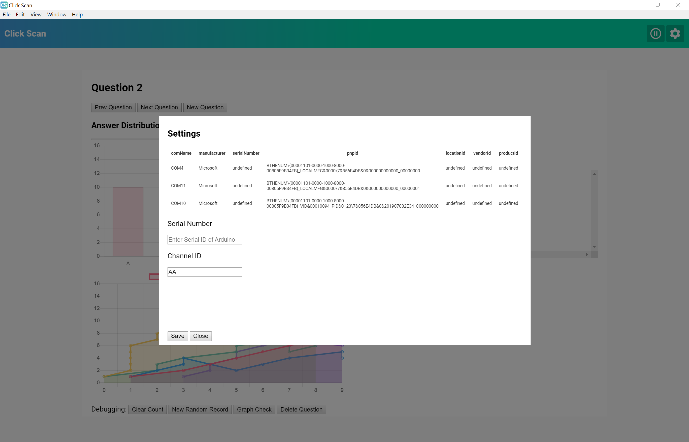

# ClickScan
A UI interface for the iSkipper software found [here](https://github.com/wizard97/iSkipper).

<p align="center">

</p>

## Features
  Allows one to connect their arduino with the iSkipper software to a computer to visualize the data and keep track of questions. Includes:

  * Chart displaying answer distribution
  * Chart displaying answer distribution over time
  * Seperate records into questions
  * Set the correct answer.
  * Pause the recording of clickers.
  * Change the clicker channel on the fly.

## Settings
  <p align="center">

</p>

  Enter the Device ID of the arduino from the list of connected serial devices. Also, change the clicker channel on the fly.


## To Use

To clone and run this repository you'll need [Git](https://git-scm.com) and [Node.js](https://nodejs.org/en/download/) (which comes with [npm](http://npmjs.com)) installed on your computer. From your command line:

```bash
# Clone this repository
git clone https://github.com/eriklangille/ClickScan.git
# Go into the repository
cd ClickScan
# Install dependencies
npm install
# Run the app
npm start
```

Learn more about Electron and its API in the [documentation](http://electron.atom.io/docs/).
